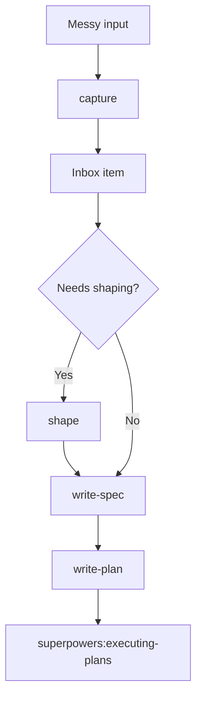
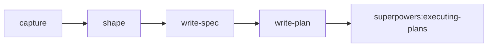

# Meanpowers

Meanpowers helps create specs and plans that coding agents can run autonomously.

It is a companion to Superpowers: Meanpowers defines the work; Superpowers executes it.

## Why Meanpowers Exists

Meanpowers is inspired by Jesse Vincent's [Superpowers](https://github.com/obra/superpowers), a skill suite I use and admire.

I created Meanpowers because I kept running into two limitations in my own workflow.

First, Superpowers' brainstorming phase was useful, but middle of the road for large or messy problems. It helped refine ideas, but it did not give me enough structure for shaping a solution when the problem space was vague, broad, or uncertain.

Second, the brainstorming and planning flow did not enforce acceptance gates strongly enough. Plans could be detailed and still let the agent decide something was done even when the behavior was not actually correct.

Meanpowers exists to fix those two gaps:

- shape vague or large work before writing specs
- define acceptance gates clearly enough that agents can prove completion

The shaping workflow also adapts ideas from [`rjs/shaping-skills`](https://skills.sh/rjs/shaping-skills/shaping), especially requirements, solution shapes, fit checks, and slicing. That work is itself based on Shape Up-style shaping and breadboarding.

## Workflow



## Skills

| Skill | Use it when | Output |
|---|---|---|
| `use-meanpowers` | You need to route work through the Meanpowers workflow | The next Meanpowers phase |
| `capture` | A conversation, transcript, or document contains multiple possible changes | Independent inbox items |
| `shape` | A change is vague, broad, high-uncertainty, or design-heavy | Confirmed shape and final slices |
| `write-spec` | The work is scoped enough to define behavior and gates | Approved behavioral spec |
| `write-plan` | A spec has been approved | Executable implementation plan |

## Meanpowers And Superpowers



Meanpowers owns work definition: capture, shape, spec, and plan.

Superpowers owns execution. After `write-plan`, the default handoff is:

```text
REQUIRED HANDOFF: superpowers:executing-plans
```

## Installation

Tell Codex:

```text
Fetch and follow instructions from https://raw.githubusercontent.com/meaningfool/meanpowers/refs/heads/main/README.md
```

Manual install:

```bash
git clone https://github.com/meaningfool/meanpowers.git .codex/meanpowers
mkdir -p .agents/skills
ln -s ../../.codex/meanpowers/skills .agents/skills/meanpowers
```

Then restart Codex.

Meanpowers expects Superpowers to be installed too, because implementation handoff uses `superpowers:executing-plans`.

## Updating

```bash
cd .codex/meanpowers
git pull
```

Restart Codex after updating so skill metadata is refreshed.
