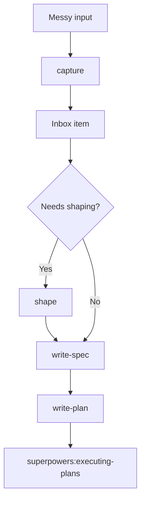
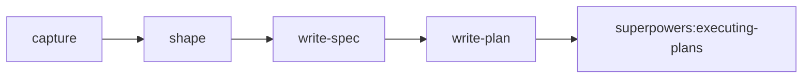

# Meanpowers

Meanpowers helps create specs and plans that coding agents can run autonomously.

It draws heavy inspiration from and is a companion to Jesse Vincent's [Superpowers](https://github.com/obra/superpowers): Meanpowers defines the work; Superpowers executes it.

## Why Meanpowers Exists

I created Meanpowers because I kept running into 2 limitations with Superpowers:
1. Superpowers' `brainstorming` is cumbersome for quick changes / small scopes, but not elaborae enough for large / messy problems. 
2. The brainstorming / planning flow does not plan around and enforce strongly enough `acceptance gates` for coding agents to reliably "finish" the work.

The shaping workflow is a copy/paste from [Ryan Singer's `shaping` skill](https://github.com/rjs/shaping-skills/tree/main/shaping), with my own tweaks and some rewriting work.

## Workflow



## Skills

| Skill | Use it when | Output |
|---|---|---|
| `use-meanpowers` | You need to route work through the Meanpowers workflow | The next Meanpowers phase |
| `capture` | A conversation, transcript, or document contains multiple possible changes | Independent inbox items |
| `shape` | A change is vague, broad, high-uncertainty, or design-heavy | Confirmed shape and final slices |
| `write-spec` | The work is scoped enough to define behavior and gates | Approved behavioral spec |
| `write-plan` | A spec has been approved | Executable implementation plan |

## Meanpowers And Superpowers



Meanpowers owns work definition: capture, shape, spec, and plan.

Superpowers owns execution. After `write-plan`, the default handoff is:

```text
REQUIRED HANDOFF: superpowers:executing-plans
```

## Installation

Tell Codex:

```text
Fetch and follow instructions from https://raw.githubusercontent.com/meaningfool/meanpowers/refs/heads/main/README.md
```

Manual install:

```bash
git clone https://github.com/meaningfool/meanpowers.git .codex/meanpowers
mkdir -p .agents/skills
ln -s ../../.codex/meanpowers/skills .agents/skills/meanpowers
```

Then restart Codex.

Meanpowers expects Superpowers to be installed too, because implementation handoff uses `superpowers:executing-plans`.

## Updating

```bash
cd .codex/meanpowers
git pull
```

Restart Codex after updating so skill metadata is refreshed.
